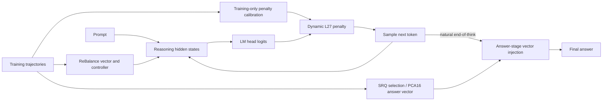

# SEU SRTP · Reasoning Compression

基于 ReBalance 的分阶段推理压缩：在 EasySteer/vLLM 上实现批量有状态引导，复用 ReBalance 信号施加动态词法惩罚，并在自然进入最终答案阶段后注入 SRQ/PCA16 答案向量。模型权重不做梯度训练或微调。

**当前发布路线：ReBalance + EasySteer/vLLM + L27 校准动态惩罚（最大 32）+ SRQ/PCA16。**

这是东南大学 SRTP 项目的研究代码发布版。ReBalance 是基础方法，EasySteer 和 vLLM 是上游框架；本项目提供状态相关词法控制、推理/答案阶段组合及其工程适配。这里的 PCA16 是项目对 SRQ/PCA-CAA 思想的明确实现选择，不是 SRQ 作者未公开代码的精确复刻。

## 方法概览



- **推理阶段**：沿用自校准 ReBalance 的向量和动态系数，在步骤边界引导。
- **L27 动态惩罚**：仅在负系数分支、步骤开头和词表匹配条件满足时，对候选 logits 减去 `k · ln(2)`。L27 是 27 个词/词组的匹配表名称，**不是第 27 层**。
- **答案阶段**：模型自然输出 `</think>` 后，在指定层按 token 加入 `0.25 · d_answer`。不强制结束推理，不替换答案，不在线读取标准答案。
- **工程实现**：逐请求状态、异步调度、图内执行、阶段切换、7B KV 重放，以及显式 BF16 舍入。

方法公式和实际代码边界见 [方法说明](docs/method.md)。

## 已完成的历史结果

模型均为 `DeepSeek-R1-Distill-Qwen`。`ReBalance` 指本项目冻结的自校准适配，**不含 L27 或答案向量**。主比较是单独 ReBalance 与完整组合；压缩率以同模型、同数据集的无干预总输出 token 为分母。

| 模型 | 数据集 | ReBalance 准确率 % | 完整组合准确率 % | ReBalance 平均 token | 完整组合平均 token | 完整组合压缩率 |
|---|---|---:|---:|---:|---:|---:|
| 1.5B | MATH-500 | 82.20 | 79.80 | 3554.2 | 2938.0 | 34.14% |
| 1.5B | GSM8K | 79.00 | 77.63 | 846.4 | 711.0 | 39.39% |
| 7B | MATH-500 | 92.00 | 91.60 | 3234.1 | 2640.3 | 31.28% |
| 7B | GSM8K | 89.61 | 90.67 | 1005.4 | 800.8 | 32.41% |
| 1.5B | AMC23 | 65.00 | 67.50 | 6776.3 | 4658.0 | 36.67% |
| 7B | AMC23 | 90.00 | 82.50 | 4929.8 | 3963.1 | 32.95% |
| 1.5B | AIME25* | 26.67 | 16.67 | 9761.0 | 6484.8 | 40.33% |
| 7B | AIME25* | 40.00 | 36.67 | 9724.4 | 7360.1 | 34.38% |

这些是已有单种子实验记录，未因整理开源仓库重新生成。完整组合在这些设置下降低了 token，但准确率并非普遍保持或提升。MATH-500/GSM8K 的历史基线与新方案存在引擎批次配置差别，不能将点值差异当作严格同配置的因果结果。*AIME25 使用项目保存的题面版本，部分文字与公开数据不同；不等同于任意当前在线版本。完整计数、答案向量消融和比较限制见 [结果说明](docs/results.md) 与 [CSV](results/historical_results.csv)。

## 快速开始

### CPU 检查

```bash
git clone https://github.com/qlaxyy/SEU-srtp-ReasoningCompression.git
cd SEU-srtp-ReasoningCompression
python -m venv .venv
source .venv/bin/activate
python -m pip install -e '.[test]'
python -m reasoning_compression.cli --model 1p5b --dataset math500 --method full --dry-run
python -m pytest -q
```

不安装 PyTorch 时，纯 CPU 配置/数据/公式检查可以运行，张量内核测试会跳过。运行完整 CPU 测试可另装 CPU 版 PyTorch。Windows 可执行 CPU 检查；实际推理使用 Linux + NVIDIA GPU。

### GPU 环境和一次完整测评

历史环境为 Python 3.12、PyTorch 2.11.0+cu129、固定版本的 EasySteer/vLLM，单张 RTX 4090 D 24 GB。不要直接用任意 PyPI vLLM 替代项目分支。

```bash
# 在独立的 Python 3.12 环境中安装；会下载推理依赖，不下载模型权重
bash scripts/install_gpu.sh
python scripts/prepare_data.py --dataset math500

# MODEL_PATH 指向自行下载的官方模型本地快照
python -m reasoning_compression.cli \
  --model 1p5b --dataset math500 --method full \
  --input data/math500/questions.json \
  --model-path "$MODEL_PATH" \
  --output outputs/1p5b_math500_full_s42 --execute
```

`--method` 支持 `unsteered`、`rebalance`、`l27`、`dynamic32`、`full`。`full` 是动态 32 + 答案向量，`l27` 是固定 `ln 2` 惩罚。默认完整数据集，`--max-samples` 只用于明确标记的小样本检查。执行时校验源代码、模型与数据身份，输出目录已存在则拒绝覆盖。

新增的公开启动入口已经做 CPU 检查；本次发布未重跑 GPU。原计算核心保留，组合方法的 GPU 执行先运行零强度、非零影响和 7B 重放工程检查，通过才进入正式生成。安装、评分、批量运行和故障排查见 [复现指南](docs/reproduction.md)。

## 仓库内容

| 目录 | 内容 |
|---|---|
| `reasoning_compression/` | 统一 CLI、配置、输入隔离、CPU 拟合公式 |
| `runtime/1p5b/`, `runtime/7b/` | 最终实验的阶段控制、词法惩罚、答案注入与工程检查 |
| `runtime/overlays/vllm/` | 相对固定上游版本的 12 份运行时覆盖文件 |
| `assets/` | 模型专属的小型引导向量、拟合参数、词表匹配自动机及来源校验 |
| `configs/datasets/` | 历史测试题的顺序与身份哈希，不含题面或答案 |
| `scripts/` | 引擎准备、数据准备、训练集拟合、评测、汇总 |
| `tests/` | 公式、输入隔离、阶段切换、零强度、请求重排与重放检查 |
| `results/`, `docs/` | 历史聚合结果、方法与复现说明、探索方向记录 |
| `third_party/`, `licenses/` | 必要的上游小型源码、判分器与许可证 |

不附带模型权重、完整输出、付费标注原文、私人实验目录和连接凭据。使用发布向量即可进行推理；重新构建答案向量需要自行提供训练特征与 SRQ 标签，见 [校准与向量构建](docs/calibration.md)。

## 上游与许可

感谢 [ReBalance](https://github.com/yu-lin-li/ReBalance)、[EasySteer](https://github.com/ZJU-REAL/EasySteer)、[vLLM](https://github.com/vllm-project/vllm) 及相关向量引导工作。固定版本、修改范围、SRQ/PCA 的来源与许可见 [第三方说明](THIRD_PARTY_NOTICES.md)。新代码采用 Apache-2.0；第三方文件保留其原许可。
