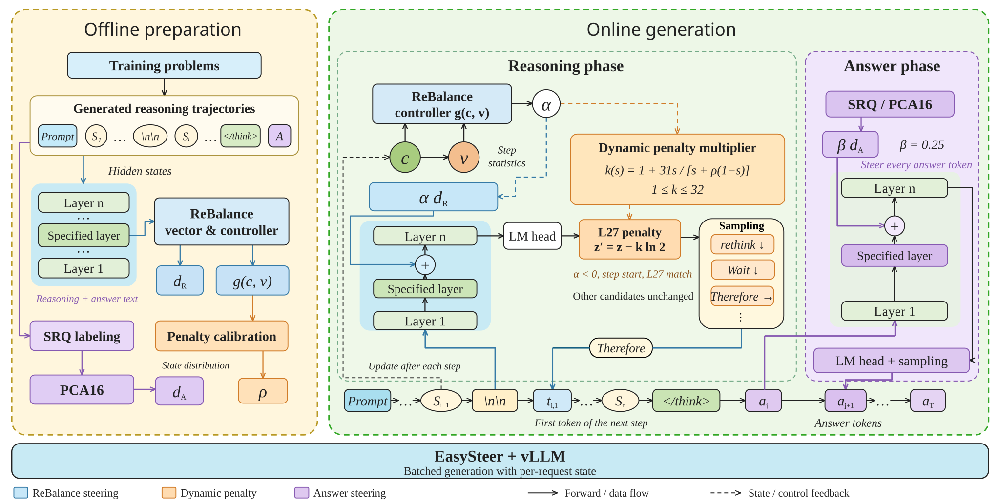

# SRTP · Reasoning Compression

本项目构建了无需模型微调的思维链压缩方案：ReBalance 方法在思考阶段的推理步骤开头，向模型隐藏状态加入引导向量，根据已完成步骤的置信度及其波动动态调整引导方向和强度，同时对选定的反思词施加经数据校准的动态惩罚；模型自然结束思考后，再启用由 SRQ 筛选样本和 PCA16 子空间构造的答案引导向量。工程实现上，借助 EasySteer 将动态引导与分阶段控制适配到 vLLM 的批量生成流程，显著加快校准轨迹生成和测试推理。

## 方法概览



1. **离线准备**：从训练题的推理轨迹中提取 ReBalance 向量与控制参数、校准惩罚曲线，并通过 SRQ 样本筛选与 PCA16 子空间构造答案向量。
2. **推理阶段**：在步骤开头注入 ReBalance 向量；当动态系数为负且候选命中 L27 词表时，对其 logits 减去 `k · ln(2)`。L27 包含 27 个反思词或词组，惩罚倍数 `k` 随状态变化，最大为 32。
3. **答案阶段**：模型输出 `</think>` 后，在指定层按 token 加入 `0.25 · d_answer`，引导最终答案生成。
4. **批量执行**：EasySteer/vLLM 为各请求维护状态，将上述控制接入批量生成流程。

公式与实现细节见 [方法说明](docs/method.md)，离线拟合过程见 [校准与向量构建](docs/calibration.md)。

## 实验结果

模型均为 `DeepSeek-R1-Distill-Qwen`。以单独 ReBalance 的自校准适配为优化基线，完整组合为 **ReBalance + 动态 L27（最大 32）+ SRQ/PCA16 答案向量**。压缩率以同模型、同数据集的无干预总输出 token 为分母。

| 模型 | 数据集 | ReBalance 准确率 % | 完整组合准确率 % | ReBalance 平均 token | 完整组合平均 token | 完整组合压缩率 |
|---|---|---:|---:|---:|---:|---:|
| 1.5B | MATH-500 | 82.20 | 79.80 | 3554.2 | 2938.0 | 34.14% |
| 1.5B | GSM8K | 79.00 | 77.63 | 846.4 | 711.0 | 39.39% |
| 7B | MATH-500 | 92.00 | 91.60 | 3234.1 | 2640.3 | 31.28% |
| 7B | GSM8K | 89.61 | 90.67 | 1005.4 | 800.8 | 32.41% |
| 1.5B | AMC23 | 65.00 | 67.50 | 6776.3 | 4658.0 | 36.67% |
| 7B | AMC23 | 90.00 | 82.50 | 4929.8 | 3963.1 | 32.95% |
| 1.5B | AIME25* | 26.67 | 16.67 | 9761.0 | 6484.8 | 40.33% |
| 7B | AIME25* | 40.00 | 36.67 | 9724.4 | 7360.1 | 34.38% |

完整组合在以上设置中减少了 31.28%–40.33% 的输出 token；相较单独 ReBalance，准确率在 1.5B AMC23 和 7B GSM8K 上提升，在其余设置中下降。

表中为 seed 42 的历史实验。MATH-500/GSM8K 的基线与完整组合使用了不同的引擎批次配置；AIME25* 使用项目保存的题面版本，部分文字经过调整。完整计数、配置与消融见 [结果说明](docs/results.md) 和 [结果 CSV](results/historical_results.csv)。

## 运行流程

仓库提供 1.5B 和 7B 的引导向量、控制参数与校准曲线，可直接用于推理。以下以 1.5B 模型的完整 MATH-500 测评为例。

### 1. 安装环境

使用 Linux、Python 3.12 和 NVIDIA GPU。实验使用单张 RTX 4090 D 24 GB；安装脚本会配置项目固定版本的 EasySteer/vLLM 和推理依赖。

```bash
git clone https://github.com/qlaxyy/SEU-srtp-ReasoningCompression.git
cd SEU-srtp-ReasoningCompression
python3.12 -m venv .venv
source .venv/bin/activate
bash scripts/install_gpu.sh
```

### 2. 准备模型与数据

下载官方 [DeepSeek-R1-Distill-Qwen-1.5B](https://huggingface.co/deepseek-ai/DeepSeek-R1-Distill-Qwen-1.5B) 模型，将 `MODEL_PATH` 设置为本地模型目录。数据准备脚本会下载测试集，并分别保存题目与评分答案。

```bash
export CUDA_VISIBLE_DEVICES=0
export MODEL_PATH=/path/to/DeepSeek-R1-Distill-Qwen-1.5B
python scripts/prepare_data.py --dataset math500
```

### 3. 生成答案

以下命令依次运行无干预、单独 ReBalance 和完整组合，分别用于计算压缩率、比较优化基线与评估完整方案。默认生成全部 500 题，使用 seed 42、temperature 0.7、top-p 0.95，每题最多生成 16,000 token。

```bash
MODEL=1p5b DATASET=math500 SEED=42 \
  METHODS="unsteered rebalance full" ACTION=--execute \
  bash scripts/run_benchmarks.sh
```

已有基线结果时，将 `METHODS` 设为 `"full"` 即可只运行完整组合。结果按方法保存到 `outputs/1p5b_math500_<method>_s42/`。

### 4. 评分与汇总

评分使用 ReBalance 的答案提取与数学等价判定，在独立的 CPU 环境中运行：

```bash
python3.12 -m venv .venv-grade
.venv-grade/bin/python -m pip install -r requirements-grading.txt

for method in unsteered rebalance full; do
  .venv-grade/bin/python scripts/grade.py \
    --run "outputs/1p5b_math500_${method}_s42" \
    --gold data/math500/gold.json
done

.venv-grade/bin/python scripts/summarize.py \
  --runs outputs --output outputs/summary.csv
```

每组结果保存在对应目录的 `SUMMARY.json` 中；`outputs/summary.csv` 汇总准确率、平均与总输出 token、相对无干预的压缩率，以及相对单独 ReBalance 的准确率变化。

### 其他模型与消融

- **7B 模型**：下载 [DeepSeek-R1-Distill-Qwen-7B](https://huggingface.co/deepseek-ai/DeepSeek-R1-Distill-Qwen-7B)，更新 `MODEL_PATH`，将运行命令中的 `MODEL` 改为 `7b`，并对应调整评分路径。
- **其他数据集**：GSM8K 和 AMC23 的数据标识分别为 `gsm8k`、`amc23`，替换数据准备、生成与评分命令中的 `math500` 即可。AIME25 的题面版本准备见 [复现指南](docs/reproduction.md#datasets)。
- **模块消融**：`l27` 为 ReBalance + 固定词法惩罚，`dynamic32` 为 ReBalance + 动态惩罚，`full` 进一步加入答案向量。将这些标识填入 `METHODS` 即可选择运行。

详细环境配置、单次运行参数和故障排查见 [复现指南](docs/reproduction.md)。

## 仓库内容

| 目录 | 内容 |
|---|---|
| `reasoning_compression/` | 统一入口、配置与拟合公式 |
| `runtime/` | 推理与答案阶段控制、词法惩罚及 vLLM 适配 |
| `assets/`, `configs/` | 引导向量、控制参数、词表与数据配置 |
| `scripts/` | 环境安装、数据准备、离线拟合、评分与汇总 |
| `tests/` | 控制公式与运行时行为检查 |
| `results/`, `docs/` | 实验结果、方法说明、复现指南与探索记录 |
| `third_party/`, `licenses/` | 必要的上游小型源码、判分器与许可证 |

## 上游与许可

感谢 [ReBalance](https://github.com/yu-lin-li/ReBalance)、[EasySteer](https://github.com/ZJU-REAL/EasySteer)、[vLLM](https://github.com/vllm-project/vllm) 及相关向量引导工作。固定版本、修改范围、SRQ/PCA 的来源与许可见 [第三方说明](THIRD_PARTY_NOTICES.md)。新代码采用 Apache-2.0；第三方文件保留其原许可。
